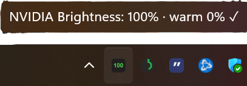
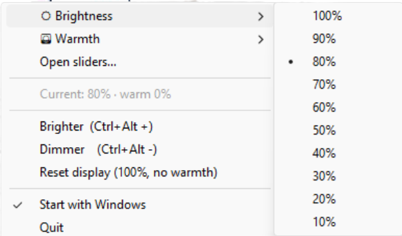

# NVIDIA Brightness Tray

A lightweight Windows system-tray app to control display **brightness** and **color temperature (warmth)** — no NVIDIA Control Panel needed. Adjustments are applied at the driver level via the GDI gamma ramp (`SetDeviceGammaRamp`), the same mechanism the Control Panel's brightness slider uses.

## Features

- **Tray icon** showing the current brightness level as a number.
- **Brightness control** in 10% steps via the menu, fine control via a popup slider, and global hotkeys.
- **Warmth (color temperature)** — reduce blue light with an amber tint, manual presets or fine slider. Independent of brightness.
- **Popup slider window** — always-on-top, drag brightness and warmth with live preview.
- **Global hotkeys** — `Ctrl+Alt +` brighter, `Ctrl+Alt -` dimmer.
- **Reset** — one click back to 100% brightness, no warmth.
- **Persists** brightness and warmth across restarts.
- **Survives sleep/resume and display changes** — re-applies the gamma ramp after the system wakes or after fullscreen games / resolution changes reset it.
- **Start with Windows** toggle — creates/removes a Startup shortcut. Auto-enabled on first launch.

## Screenshots

Tray icon showing the current brightness level, with status tooltip:



Right-click menu — brightness steps, warmth, sliders, reset, and autostart toggle:



## Requirements

- Windows
- Python 3.x (developed on 3.14)
- Dependencies:

```
pip install pystray pillow keyboard pywin32
```

`tkinter` (slider window) ships with CPython. `keyboard` and `pywin32` are optional — without them, hotkeys and some power-event handling degrade gracefully, but brightness/warmth still work via the menu and slider.

## Running

```
pythonw nvidia_brightness_tray.py   # silent, no console window (normal use)
python  nvidia_brightness_tray.py   # with console logs (debugging)
```

> If brightness changes don't take effect, run as Administrator — setting the gamma ramp can require elevation on some systems.

## Usage

Right-click the tray icon:

| Menu item | Action |
|-----------|--------|
| ☀ Brightness ▸ | Pick a level, 100% down to 10% in 10% steps |
| 🌅 Warmth ▸ | Off / Low / Medium / High / Max |
| Open sliders… | Popup window with live brightness + warmth sliders |
| Current: N% · warm N% | Status (read-only) |
| Brighter / Dimmer | Step brightness (same as hotkeys) |
| Reset display | 100% brightness, no warmth |
| Start with Windows | Toggle launch at login |
| Quit | Exit |

**Hotkeys:** `Ctrl+Alt +` (brighter), `Ctrl+Alt -` (dimmer).

## Auto-start

"Start with Windows" creates a shortcut to the silent `pythonw` build in:

```
%APPDATA%\Microsoft\Windows\Start Menu\Programs\Startup\NvidiaBrightnessTray.lnk
```

It is created automatically on first run and can be toggled off from the menu. Once you turn it off, it stays off (it is not re-created on later launches).

## How it works

- **Gamma ramp** — `_compute_ramp(brightness, warmth)` builds a 3×256 16-bit gamma table. Red is left linear; green and blue are scaled down as warmth rises (blue most), producing the amber tint. Applied with GDI `SetDeviceGammaRamp` on the primary display.
- **Settings** — saved to `%APPDATA%\NvidiaBrightnessTray\settings.json` as `{ "brightness", "warmth" }`. Loaded and applied on startup.
- **Power/display events** — a hidden message window listens for `WM_POWERBROADCAST` (resume) and `WM_DISPLAYCHANGE`, re-applying the current ramp so it isn't lost after sleep or fullscreen games.
- **Slider window** — a Tkinter window on its own thread, shown via the thread-safe `event_generate` call.

## Development

Pure logic (gamma math, settings load/save) is unit-tested:

```
python -m pytest tests/test_brightness_logic.py -v
```

GUI, GDI gamma calls, tray icon, hotkeys, and OS power/display events require a real display and are verified manually.

## License

[MIT](LICENSE) © igorl-commits
